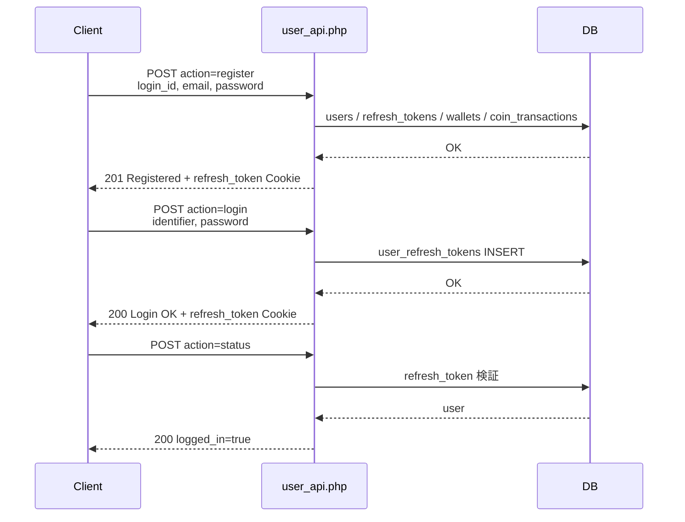
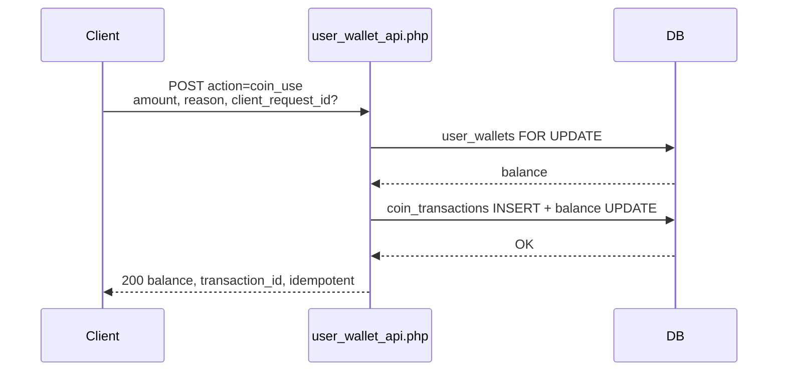
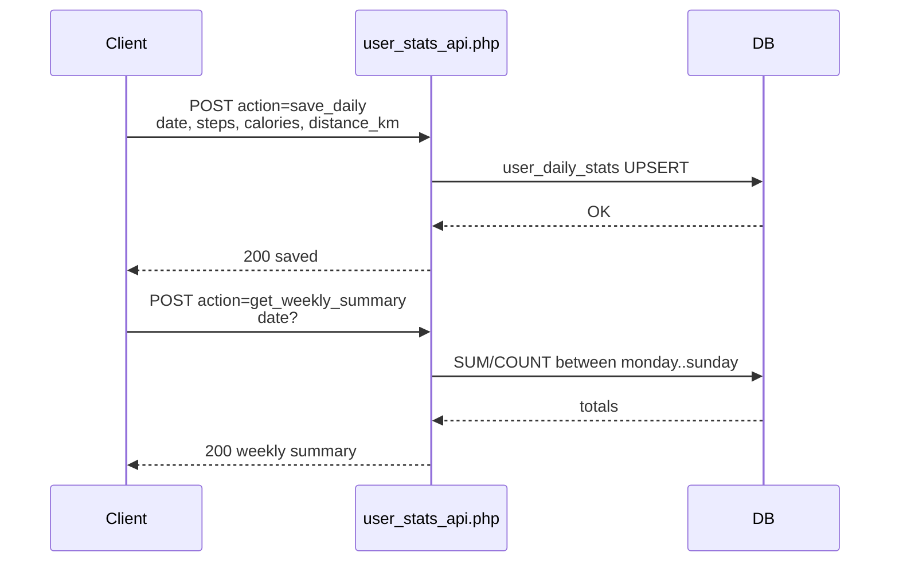

# 共通仕様

すべてのAPIに適用される共通仕様です。

---

## リクエスト形式

- 全エンドポイントは `POST` のみ対応
- `Content-Type: application/json` の場合、JSON本文がパラメータとして処理される
- 認証は `refresh_token`（HTTP-only Cookie）によるCookie認証

---

## エラーレスポンス形式

```json
{
  "error": {
    "code": "string",
    "message": "string",
    "detail": "any (optional)",
    "fields": "object (optional)",
    "i18n_key": "string (optional)"
  }
}
```

---

## 日付形式

| 用途 | 形式 |
|------|------|
| クライアント入出力 | `YYYY/MM/DD` |
| DB内部 | `YYYY-MM-DD` |

---

## 用語集

| 用語 | 意味 |
|------|------|
| `login_id` | ログイン用ID（ユーザー名） |
| `identifier` | `login_id` または `email` のどちらでも可 |
| `refresh_token` | Cookieに保存される認証トークン |
| `token_id` | 発行済みリフレッシュトークンのID |
| `device_name` | 端末名（未指定時はUser-Agentから推定） |
| `client_request_id` | 冪等性のためのリクエストID |
| `balance` | 残高（コイン/スタンプ） |
| `delta` | 増減量（プラス/マイナス） |
| `reason` | 増減や操作の理由 |
| `meta` | 追加情報（JSON） |
| `date_key` | 日付キー（スタンプ同期用） |
| `period_key` | 月次の期間キー（`YYYY-MM`） |
| `current_streak` | 現在の連続日数 |
| `longest_streak` | これまでの最長連続日数 |

---

## 命名規則

| プレフィックス | 意図 |
|----------------|------|
| `get_*` | 取得系（読み取りのみ） |
| `update_*` | 全体更新（未指定はnull扱い） |
| `patch_*` | 部分更新（指定項目のみ） |
| `clear_*` | 指定項目のクリア（null化） |
| `seed_*` | 初期値の投入（移行/復元用途） |
| `record_*` | 事実の記録（活動ログなど） |
| `admin_*` | 管理者限定操作 |
| `coin_*` | コイン（通貨）操作 |
| `stamp_*` | スタンプ（歩数報酬）操作 |
| `challenge_*` | チャレンジ（報酬/解放）操作 |

---

## シーケンス図

### 登録〜ログイン〜状態確認



### コイン消費



### 日次データ保存〜集計


